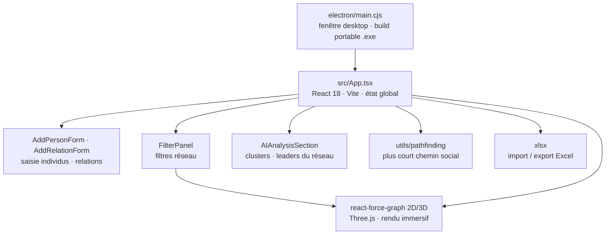

#  Mapy - Social Visualizer (Apple Edition)

<!-- adam-badges:start -->
[](https://github.com/Adam-Blf/relation_graph/commits) [](https://hits.sh/github.com/Adam-Blf/relation_graph/) [](https://github.com/Adam-Blf/relation_graph/commits) [](https://github.com/Adam-Blf/relation_graph) [](LICENSE)
<!-- adam-badges:end -->


Mapy est un visualiseur de relations sociales 3D haute performance, conçu avec l'esthétique et la fluidité d'Apple.

## Architecture



## 🚀 Fonctionnalités v0.6.0

- **Design Apple** : Interface minimaliste, Liquid Glass UI, typographie San Francisco.
- **Visualisation 2D/3D** : Basculez instantanément entre un graphe 2D précis et une expérience 3D immersive.
- **Import/Export Excel** : Gérez vos données via des fichiers Excel compatibles.
- **Social Pathfinding** : Trouvez le chemin le plus court entre deux individus.
- **Intelligence Artificielle** : Analyse automatique des clusters et des leaders du réseau.
- **Snapshot Premium** : Capturez votre graphe en haute résolution.

## 🛠️ Installation & Démarrage

```bash
# Installation des dépendances
npm install

# Démarrage en mode développement (Vite)
npm run dev

# Démarrage de l'application Electron
npm run electron:dev

# Build de l'exécutable portable (.exe)
npm run electron:build
```

## 🎨 Conception

Conçu par **Adam Beloucif** pour offrir une expérience utilisateur fluide et premium.
- Basé sur `React`, `Three.js` et `Vite`.
- Styles via `TailwindCSS` (Custom Apple Tokens).
- Icônes `Lucide React`.

---
© 2024 Adam Beloucif. Tous droits réservés.


---

<p align="center">
  <sub>Par <a href="https://adam.beloucif.com">Adam Beloucif</a> · Data Engineer & Fullstack Developer · <a href="https://github.com/Adam-Blf">GitHub</a> · <a href="https://www.linkedin.com/in/adambeloucif/">LinkedIn</a></sub>
</p>